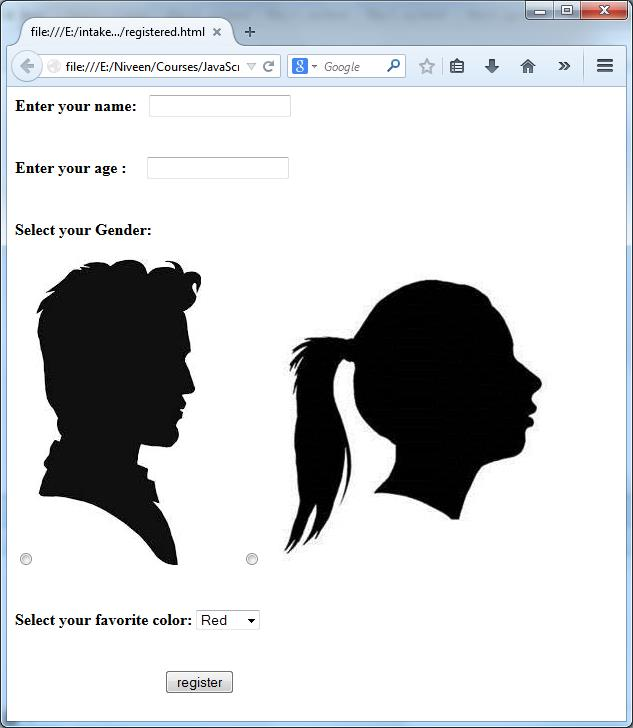
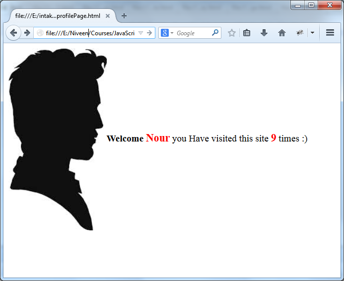

# HTML5 & CSS3 - Lab 2

## Table of Contents
  - [Lab 2](#lab-2)
    - [Exercise 1](#exercise-1)

## Lab 2
### Exercise 1
#### Cookies
  - Make your own `.js` library to create, display and delete cookies, then 
  use it in creating the required cookies to display a greeting message to 
  your visitor with displaying an image as his profile pic referring to his 
  gender, and inform him with his number of visits to the site. Display user 
  name and number of visits with font color according to his choices.
  
  
  - [Solution of Problem 1](./exercise-1)
