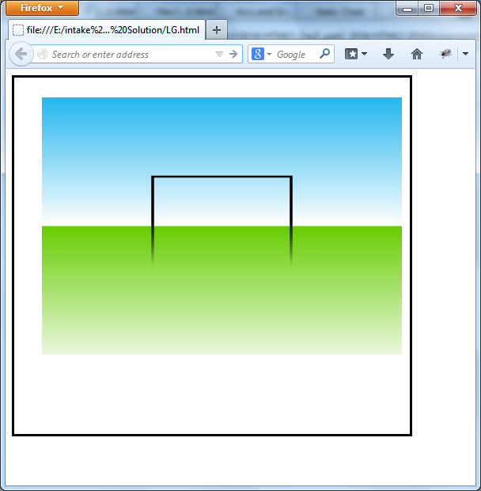
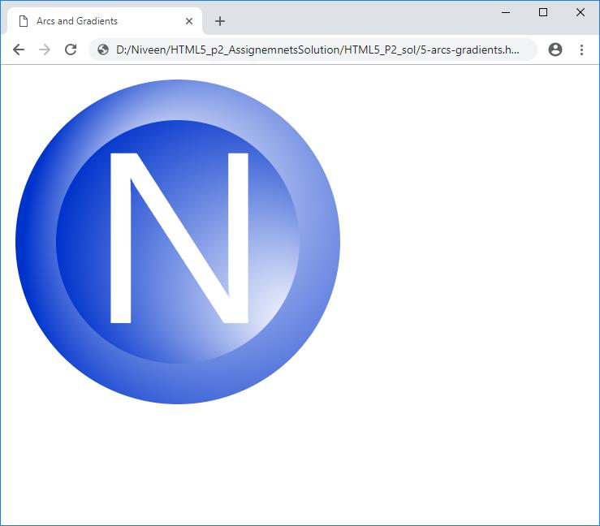
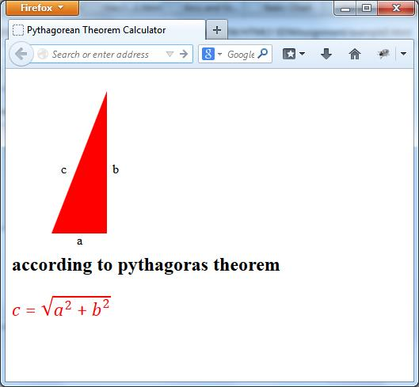

# HTML5 & CSS3 - Lab 3

## Table of Contents
  - [Lab 3](#lab-3)
    - [Exercise 1](#exercise-1)
    - [Exercise 2](#exercise-2)
    - [Exercise 3](#exercise-3)

## Lab 3
### Exercise 1
  
  - [Solution of Problem 1](./exercise-1)

### Exercise 2
  
  - [Solution of Problem 2](./exercise-2)

### Exercise 3
  
  - [Solution of Problem 3](./exercise-3)

