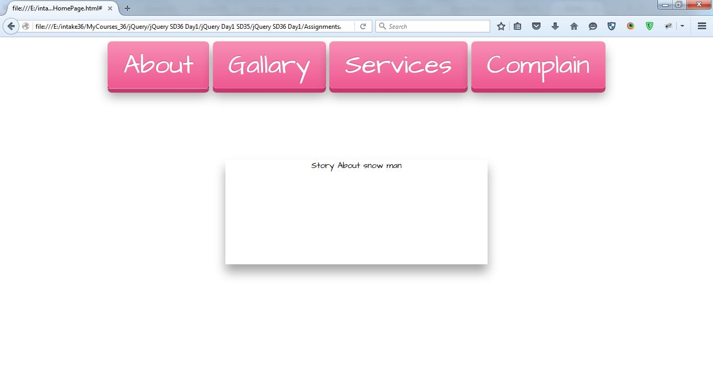
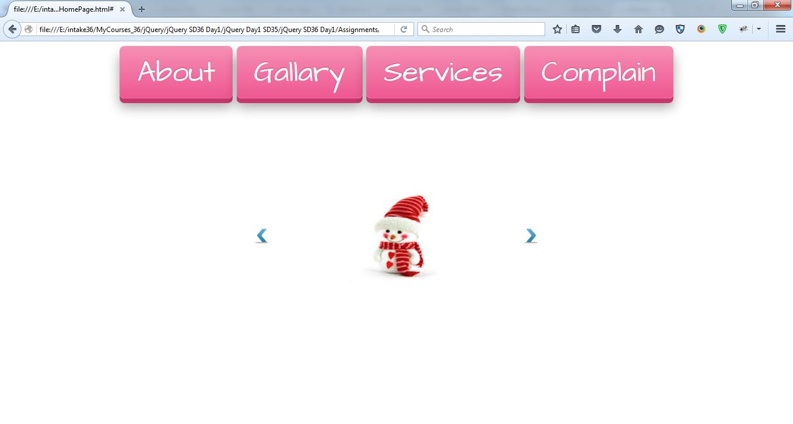
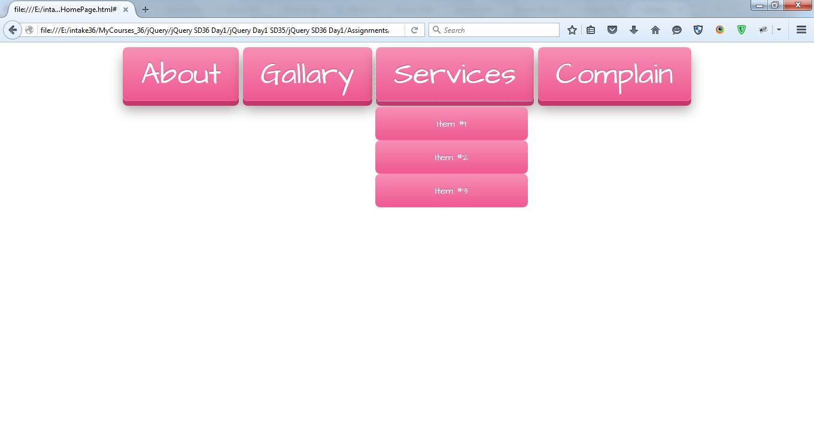
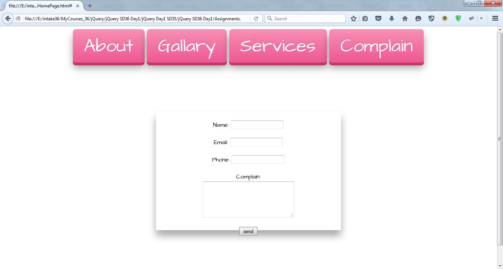

# HTML5 & CSS3 - Lab 5

## Table of Contents
  - [Lab 5](#lab-5)
    - [Exercise 1](#exercise-1)

## Lab 5
### Exercise 1
  - Make a single page website application that has a menu for the following 
  items "About", "Gallery", "Services", and "Complain". Each item targets a 
  container that is only shown when the item "service" is clicked, it shows a 
  list menu. The "complain" section opens a complain form, where send button 
  shows a preview of user entered data. The user can edit his data when edit 
  button is clicked.
  
  
  

  - [Solution of Problem 1](./exercise-1)
