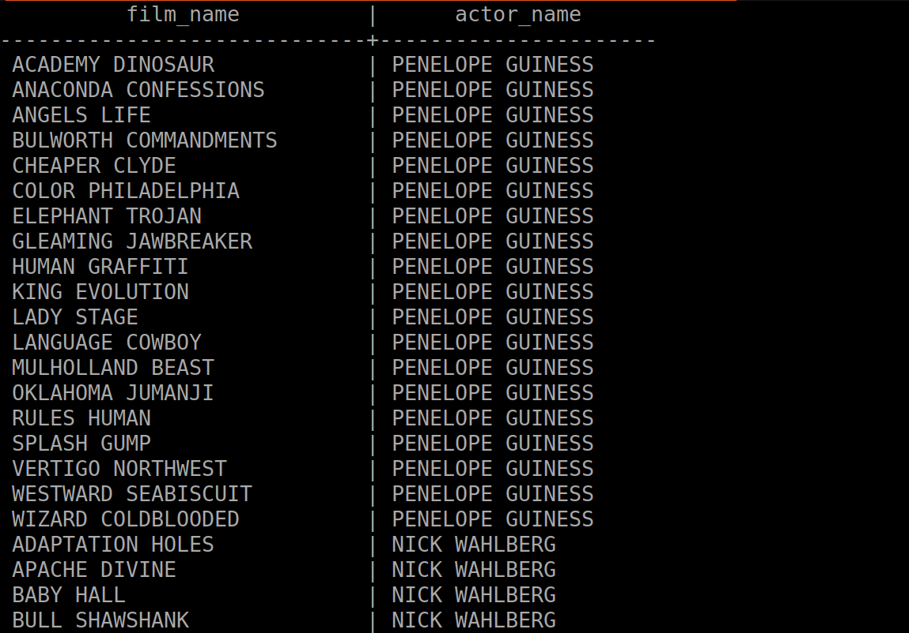
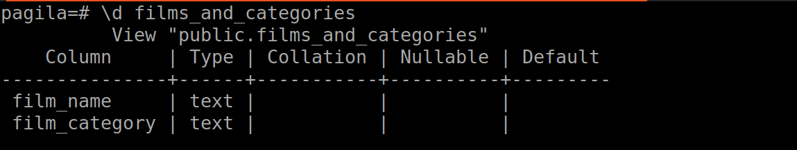
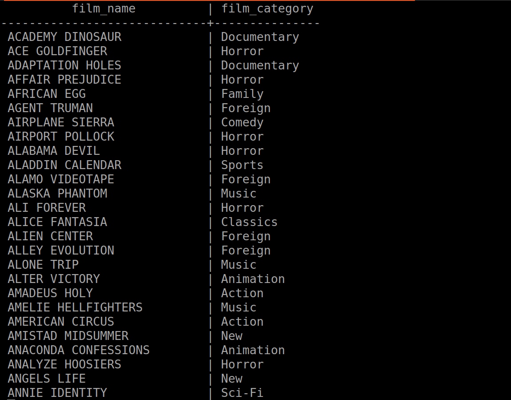
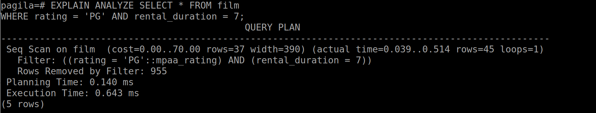
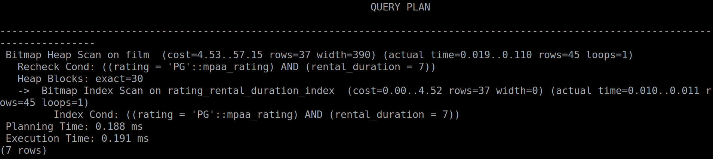

# Introduction to PostgreSQL Database - Lab 2

## Table of Contents
  - [Views](#views)
    - [Exercise 1](#exercise-1)
    - [Exercise 2](#exercise-2)
    - [Exercise 3](#exercise-3)
    - [Exercise 4](#exercise-4)
    - [Exercise 5](#exercise-5)
  - [Built-in functions](#built-in-functions)
    - [Exercise 1](#exercise-1)

## Views
### Exercise 1
  1. Create a view showing total payments per customer.

#### Ex1: Solution
  - [Problem 1 SQL Query](./views/1-total_payments_per_customer.sql)

#### Ex1: Output
  
  
  

### Exercise 2
  2. Create a view of all PG-13 rating films with their actors.

#### Ex2: Solution
  - [Problem 2 SQL Query](./views/2-pg13_films_and_actors.sql)

#### Ex2: Output
  
  
  

### Exercise 3
  3. Create a view showing films and their Categories.

#### Ex3: Solution
  - [Problem 3 SQL Query](./views/3-films_and_categories.sql)

#### Ex3: Output
  
  
  

### Exercise 4
  4. Identify which columns need indexes to optimize this query and create 
  them.

  ```sql
  SELECT customer_id FROM rental
  WHERE rental_date > '2005-05-25';
  ```
#### Ex4: Solution
  - [Problem 4 SQL Query](./views/4-optimization_by_index.sql)

### Exercise 5
  5. Create a composite index to speed up this query.

  ```sql
  SELECT * FROM film
  WHERE rating = 'PG' AND rental_duration = 7;
  ```

#### Ex5: Solution
  - [Problem 5 SQL Query](./views/5-composite_index.sql)

#### Ex5: Output
  
  


## Built-in functions
### Exercise 1
  1. Show the rental date and how many days have passed since each rental.

#### Ex1: Solution
  - [Problem 1 SQL Query](./builtin_functions/6-days_passed_from_rentals.sql)

#### Ex1: Output
  

### Exercise 2
  2. List customer names and they year they joined.

#### Ex2: Solution
  - [Problem 2 SQL Query](./builtin_functions/7-customers_and_years_joined.sql)

#### Ex2: Output
  

### Exercise 3
  3. For each payment, show a label: 'High' if amount > 8, 'Medium' if > 5, 
  else 'Low'.

#### Ex3: Solution
  - [Problem 3 SQL Query](./builtin_functions/8-payment_categories.sql)

#### Ex3: Output
  

### Exercise 4
  4. Show the payment amount and replace any null values with 0.

#### Ex4: Solution
  - [Problem 3 SQL Query](./builtin_functions/9-payment_no_nulls.sql)
