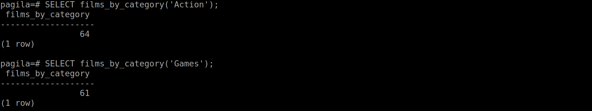
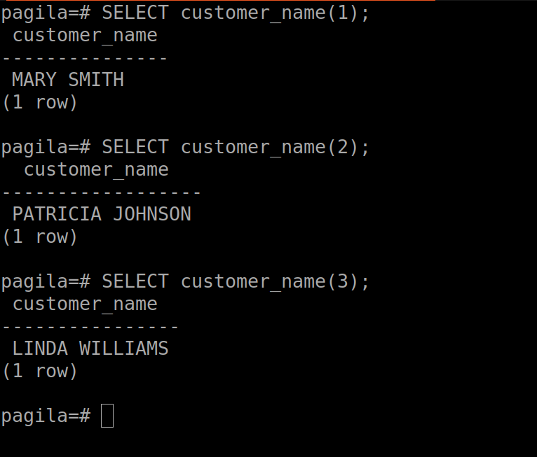
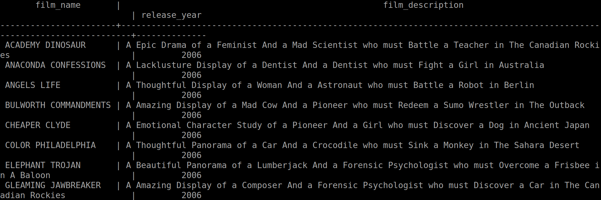
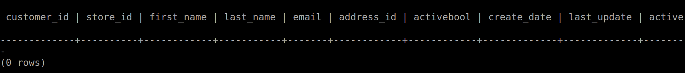
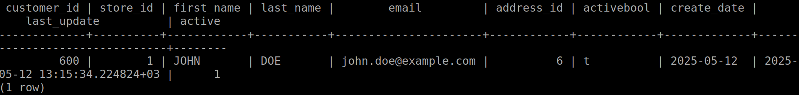
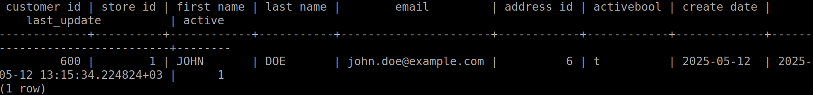

# Introduction to PostgreSQL Database - Lab 3

## Table of Contents
  - [User-defined functions](#user-defined-functions)
    - [Exercise 1](#exercise-1)
    - [Exercise 2](#exercise-2)
    - [Exercise 3](#exercise-3)
  - [Trigger](#trigger)
    - [Exercise 4](#exercise-4)
    - [Exercise 5](#exercise-5)
    - [Exercise 6](#exercise-6)
    - [Exercise 7](#exercise-7)

## User-defined functions
### Exercise 1
  1. Create a function that takes category name and returns the number of 
  films in this category.

### Ex1: Solution
  - [Problem 1 SQL Query](./user-defined_functions/1-films_by_category.sql)

### Ex1: Output
  

### Exercise 2
  2. Create a function that takes customer\_id and returns full name 
  (first\_name last\_name)

### Ex2: Solution
  - [Problem 2 SQL Query](./user-defined_functions/2-customer_full_name.sql)

### Ex2: Output
  

### Exercise 3
  3. Create a function that takes actor\_id and returns info about his films 
  (film name, film description, release year).

### Ex3: Solution
  - [Problem 3 SQL Query](./user-defined_functions/3-actor_films_info.sql)

### Ex3: Output
  

## Trigger
### Exercise 4
  4. Create a trigger to prevent setting a negative value for rental\_rate 
  column in the film table.

#### Ex4: Solution
  - [Problem 4 SQL Query](./user-defined_functions/4-prevent_negative_rentals.sql)

### Ex4: Output
  

## Exercise 5
  5. Create a trigger to save a backup for newly inserted customers. (create 
  customer\_backup table first).

#### Ex5: Solution
  - [Problem 5 SQL Query](./user-defined_functions/5-customers-backup.sql)

### Ex5: Output
  
  
  
  
  
  

### Exercise 6
  6. Create a trigger on payment table that copies deleted rows into a new 
  table deleted\_payments.

#### Ex6: Solution
  - [Problem 6 SQL Query](./user-defined_functions/6-deleted_payments.sql)

### Ex6: Output
  
  

### Exercise 7
  7. Track when a film's title is updated, and log the old and new titles 
  along with the time of the change in a new table (film\_aduit).

#### Ex7: Solution
  - [Problem 7 SQL Query](./user-defined_functions/7-film_audit.sql)

### Ex7: Output
  
  
  
