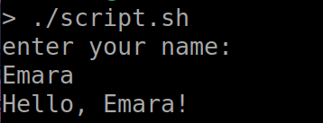
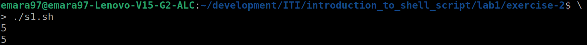
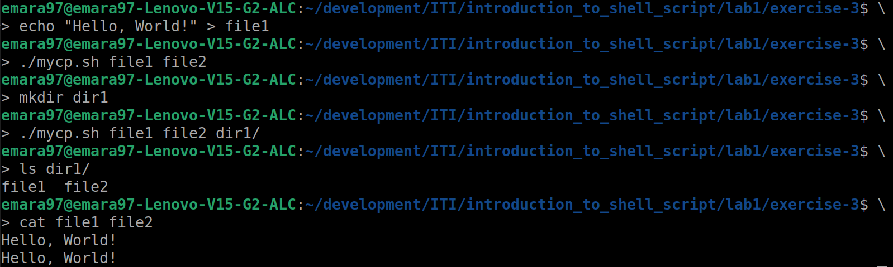
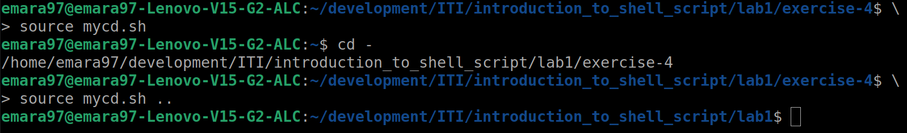
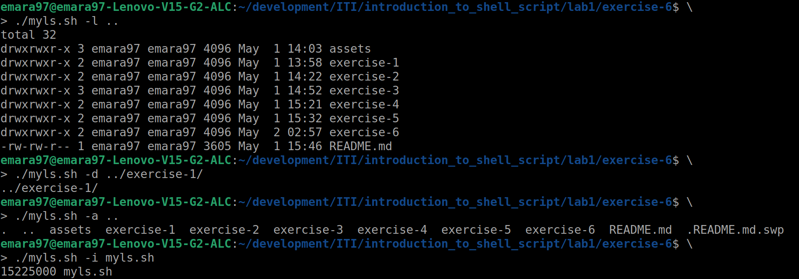
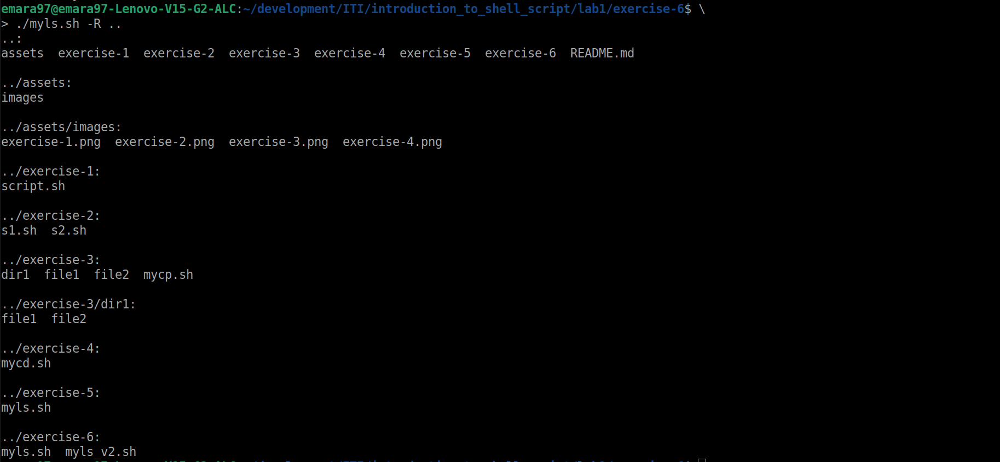

# Introduction to Shell Script - Lab 1

## Table of Contents
  - [Sudent Info.](#student-info)
  - [Exercise 1](#exercise-1)
    - [Ex1: Solution Files](#ex1-solution-files)
    - [Ex1: Output](#ex1-output)
  - [Exercise 2](#exercise-2)
    - [Ex2: Solution Files](#ex2-solution-files)
    - [Ex2: Output](#ex2-output)
  - [Exercise 3](#exercise-3)
    - [Ex3: Solution Files](#ex3-solution-files)
    - [Ex3: Usage](#ex3-usage)
    - [Ex3: Output](#ex3-output)
  - [Exercise 4](#exercise-4)
    - [Ex4: Solution Files](#ex4-solution-files)
    - [Ex4: Usage](#ex4-usage)
    - [Ex4: Output](#ex4-output)
  - [Exercise 5](#exercise-5)
    - [Ex5: Solution Files](#ex5-solution-files)
    - [Ex5: Usage](#ex5-usage)
    - [Ex5: Output](#ex5-output)
  - [Exercise 6](#exercise-6)
    - [Ex6: Solution Files](#ex6-solution-files)
    - [Ex6: Output](#ex6-output)

## Student Info.
  - _Name: Abdelrahman Amro Emara_
  - _Group: 1_
  - _Supervisor: Osama Amin_

## Exercise 1
  1. Create a script that asks for user name then send a greeting to him.

### Ex1: Solution Files
  - [Problem 1 Shell Script Solution](./exercise-1/script.sh)

### Ex1: Output
  

---

## Exercise 2
  2. Create a script called s1 that calls another script s2 where:  
     a. In s1 there is a variable called x, it's value 5  
     b. Try to print the value of x in s2 by two different ways.  

### Ex2: Solution Files
  - [Problem 2 s1.sh Solution](./exercise-2/s1.sh)
  - [Problem 2 s2.sh Solution](./exercise-2/s2.sh)

### Ex2: Output
  

---

## Exercise 3
  3. Create a script called mycp where:  
     a. It copies a file to another.  
     b. It copies multiple files to a directory.  

### Ex3: Solution Files
  - [Problem 3 mycp.sh Solution](./exercise-3/mycp.sh)

### Ex3: Usage
  ```bash
  ~/exercise-3$: echo "Hello, World!" > file1
  ~/exercise-3$: ./mycp.sh file1 file2
  ~/exercise-3$: mkdir dir1
  ~/exercise-3$: ./mycp.sh file1 file2 dir1
  ```

### Ex3: Output
  

---

## Exercise 4
  4. Create a script called mycd where:  
     a. It changed directory to the user home directory, if it is called 
     without arguments.  
     b. Otherwise, it change directory to the given directory.  

### Ex4: Solution Files
  - [Problem 4 mycd.sh Solution](./exercise-4/mycd.sh)

### Ex4: Usage
  ```bash
  ~/iti/exercise-4$: source mycd.sh
  ~/$: cd -
  /home/user/iti/exercise-4
  ~/iti/exercise-4$: source mycd.sh ..
  ~/iti/: 
  ```

### Ex4: Output
  

---

## Exercise 5
  5. Create a script called myls where:  
     a. It lists the current directory, if it is called without arguments.  
     b. Otherwise, it lists the given directory.  

### Ex5: Solution Files
  - [Problem 5 myls.sh Solution](./exercise-5/myls.sh)

### Ex5: Usage
  ```bash
  ~/iti/exercise-5$: ./myls.sh ..
  asssets     exercise-2  exercise-4  README.md
  exercise-1  exercise-3  exercise-5
  ~/iti/exercise-5$: cd ..
  ~/iti$: ./myls.sh exercise-5/
  myls.sh
  ```

### Ex5: Output
  

---

## Exercise 6
  6. Enhance the [above script](#exercise-5) to support the following options 
  individually:  
     a. -l: list in long format  
     b. -a: list all entries including the hiding files.  
     c. -d if an argument is a directory, list only its name.  
     d. -i: print inode number  
     e. -R: recursively list subdirectories.  

### Ex6: Solution Files
  - [Problem 5 myls.sh Solution](./exercise-6/myls.sh)

### Ex6: Output
  
  
