# Introduction to Shell Script - Lab 2

## Table of Contents
  - [Student Info.](#student-info)
  - [Using sed Utility](#using-sed-utility)
  - [Using awk Utility](#using-awk-utility)

## Student Info.
  - _Name: Abdelrahman Amro Emara_
  - _Group: 1_
  - _Supervisor: Osama Amin_a

## Using sed Utility
### Exercise 1
  1. Display the lines that contain the word "lp" in /etc/passwd file.

#### Ex1: Solution Files
  - [Problem 1 script.sh Solution File](./exercise-1/script.sh)

#### Ex1: Output
  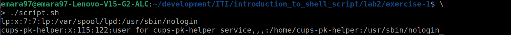

---

### Exercise 2
  2. Display /etc/passwd file except the third line.

#### Ex2: Solution Files
  - [Problem 2 script.sh Solution File](./exercise-2/script.sh)

#### Ex2: Output
  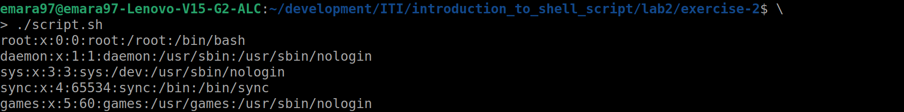

---

### Exercise 3
  3. Display /etc/passwd file except the last line.

#### Ex3: Solution Files
  - [Problem 3 script.sh Solution File](./exercise-3/script.sh)

#### Ex3: Output
  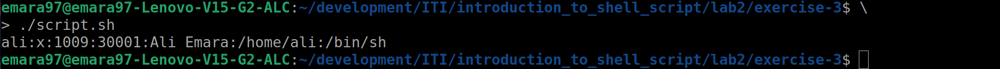

---

### Exercise 4
  4. Display /etc/passwd file except the lines that contain the word "lp".

#### Ex4: Solution Files
  - [Problem 4 script.sh Solution File](./exercise-4/script.sh)

#### Ex4: Output
  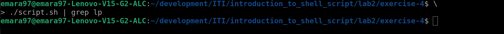

---

### Exercise 5
  5. Substitute all the words that contain "lp" with "mylp" in /etc/passwd 
  file.

#### Ex5: Solution Files
  - [Problem 5 script.sh Solution File](./exercise-5/script.sh)

#### Ex5: Output
  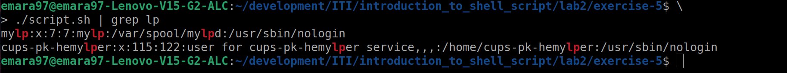

## Using awk Utility
### Exercise 1
  1.Print full name (comment) of all users in the system. 

#### Ex1: Solution Files
  - [Problem 1 script.sh Solution File](./exercise-6/script.sh)

#### Ex1: Output
  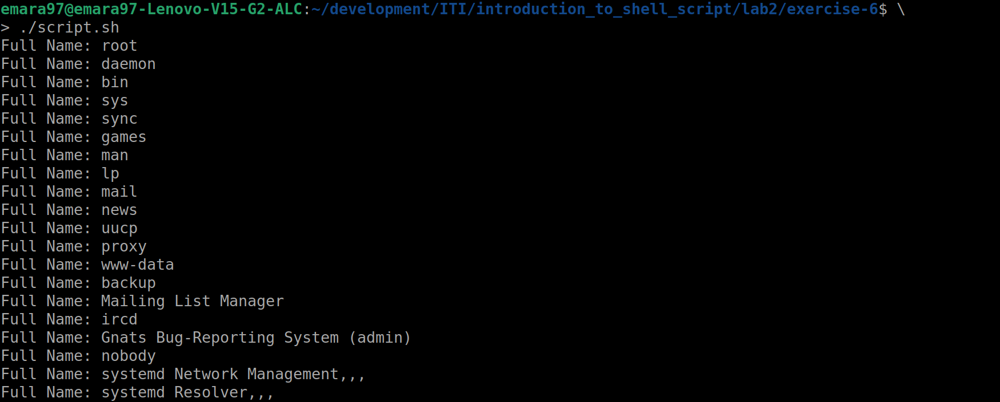

### Exercise 2
  2.Print login, full name (comment) and home directory of all users.
  (Print each line preceded by a line number)

#### Ex2: Solution Files
  - [Problem 2 script.sh Solution File](./exercise-7/script.sh)

#### Ex2: Output
  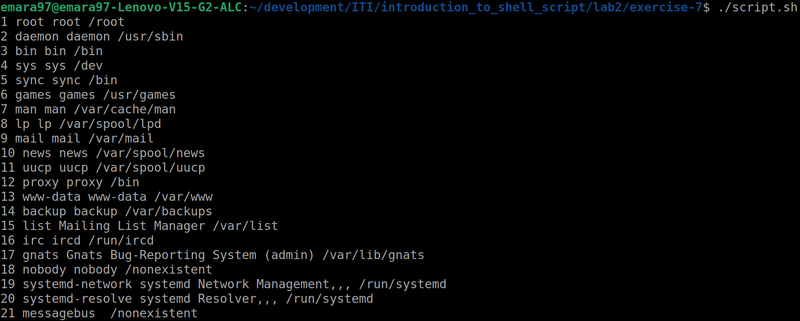

### Exercise 3
  3. Print login, uid and full name (comment) of those uid is greater than 500.

#### Ex3: Solution Files
  - [Problem 3 script.sh Solution File](./exercise-8/script.sh)

#### Ex3: Output
  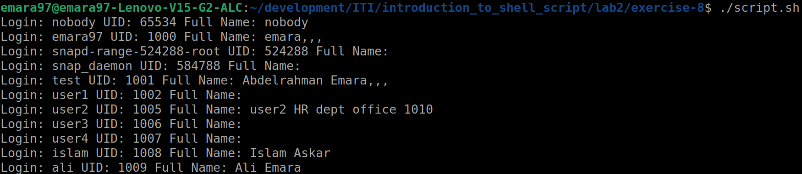

### Exercise 4
  4. Print login, uid and full name (comment) of those uid is exactly 500.

#### Ex4: Solution Files
  - [Problem 4 script.sh Solution File](./exercise-9/script.sh)

#### Ex4: Output
  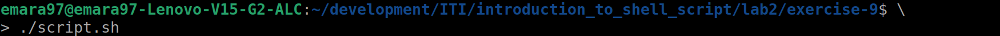

### Exercise 5
  5. Print line from 5 to 15 from /etc/passwd.

#### Ex5: Solution Files
  - [Problem 5 script.sh Solution File](./exercise-10/script.sh)

#### Ex5: Output
  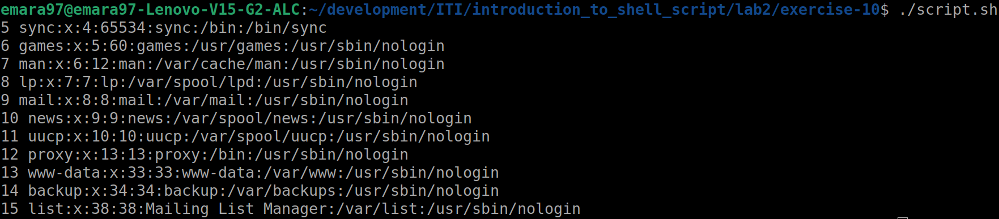

### Exercise 6
  6. Change lp to mylp

#### Ex6: Solution Files
  - [Problem 6 script.sh Solution File](./exercise-11/script.sh)

#### Ex6: Output
  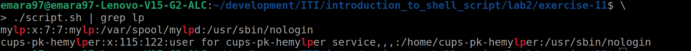

### Exercise 7
  7. Print all information about greatest uid.

#### Ex7: Solution Files
  - [Problem 8 script.sh Solution File](./exercise-12/script.sh)

#### Ex7: Output
  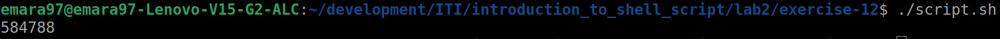

### Exercise 8
  8. Get the sum of all accounts id's.

#### Ex8: Solution Files
  - [Problem 8 script.sh Solution File](./exercise-13/script.sh)

#### Ex8: Output
  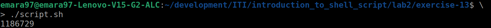
