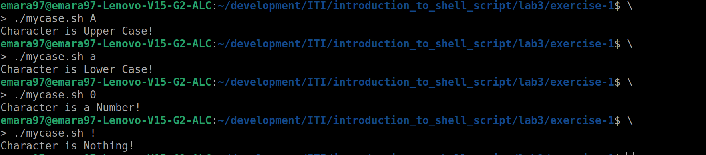

# Introduction to Shell Script - Lab 2

## Table of Contents
  - [Student Info.](#student-info)
  - [Exercise 1](#exercise-1)
  - [Exercise 2](#exercise-2)
  - [Exercise 3](#exercise-3)
  - [Exercise 4](#exercise-4)
  - [Exercise 5](#exercise-5)
  - [Exercise 6](#exercise-6)

## Student Info.
  - _Name: Abdelrahman Amro Emara_
  - _Group: 1_
  - _Supervisor: Osama Amin_

## Exercise 1
  1. Write a script called mycase, using the case utility to check the type 
  of character entered by a user:  
     a. Upper Case.
     b. Lower Case.
     c. Number.
     d. Nothing.

### Ex1: Solution
  - [Problem 1 mycase.sh Solution](./exercise-1/mycase.sh)

### Ex1: Output
  

## Exercise 2
  2. Enhanced the previous script, by checking the type of string entered by 
  a user:  
     a. Upper Cases.
     b. Lower Cases.
     c. Numbers.
     d. Mix.
     e. Nothing.

### Ex2: Solution
  - [Problem 2 mycase.sh Solution](./exercise-2/mycase.sh)

## Exercise 3
  3. Write a script called mychmod using for utility to give execute 
  permission to all files and directories in your home directory.

### Ex3: Solution
  - [Problem 3 mychmod.sh Solution](./exercise-3/mychmod.sh)

## Exercise 4
  4. Write a script called mybackup using for utility to create a backup 
  of only files in your home directory.

### Ex4: Solution
  - [Problem 4 mychmod.sh Solution](./exercise-4/mybackup.sh)

## Exercise 5
  5. Write a script called mymail using for utility to send a mail to all 
  users in the system.  
  _Note: write the mail body in a file called mtemplate._

### Ex5: Solution
  - [Problem 5 mychmod.sh Solution](./exercise-5/mymail.sh)
  - [Problem 5 mail body](./exercise-5/mtemplate)

## Exercise 6
  6. Write a script called chkmail to check for new mails every 10 seconds.  
  _Note: mails are saved in /var/mail/username._

### Ex6: Solution
  - [Problem 6 mychmod.sh Solution](./exercise-6/chkmail.sh)
